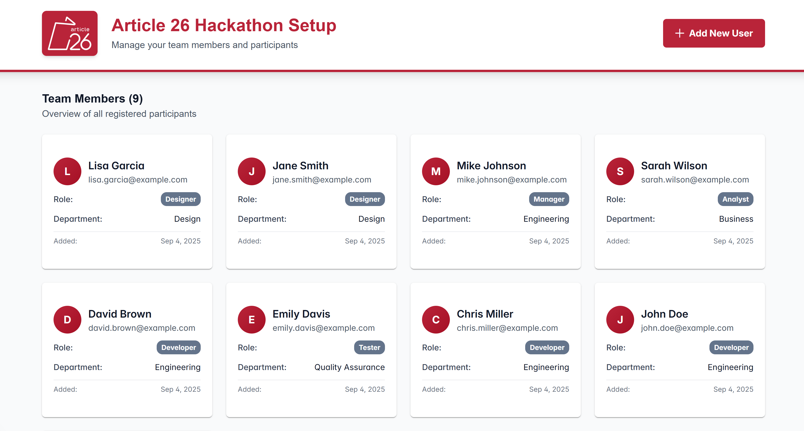

# Article 26 Hackathon - Enterprise Time Booking System

Welcome to the Article 26 Hackathon! This repository serves as the foundation for building an enterprise-grade time booking system for German consultant companies. The goal is to implement a comprehensive solution that allows employees to accurately track their working time while ensuring compliance with German labor laws.

## 📋 Table of Contents

- [🎯 Hackathon Goal](#-hackathon-goal)
- [🛠️ Installation Requirements](#️-installation-requirements)
- [🚀 Quick Start](#-quick-start)
- [📁 Repository Structure](#-repository-structure)
- [🎯 Getting Started with Development](#-getting-started-with-development)

## 🎯 Hackathon Goal

The objective of this hackathon is to develop a **time booking system** that enables:

- **Daily time tracking** with time slot management
- **Project assignment** for billable hours and internal controlling
- **Compliance with German Working Time Law (ArbZG)** 
- **Vacation and sick leave management**
- **Working hour account tracking** (overtime/undertime)

The complete feature backlog and user stories are available in our [GitHub Project](https://github.com/users/DanielStuewe/projects/1) which contains 15 user stories organized across 4 milestones:

### 📋 Backlog Overview

**Milestone 1: Basic Project Booking**
- Book daily working time with time slots
- Add comments to time slots  
- Assign bookings to project accounts

**Milestone 2: Advanced Project Booking**
- Create tasks for task-mode accounts
- Validate non-overlapping time bookings
- Highlight conflicting bookings
- Enforce German Working Time Law (ArbZG)
- Batch booking operations

**Milestone 3: Vacation and Sick Leave**
- Vacation booking with balance tracking
- Prevent vacation overbooking (30 days max)
- Show residual vacation days
- Full/half-day vacation options
- Sick leave booking

**Milestone 4: Working Hour Account**
- Track overtime/undertime in working hour account
- Enforce overtime limits (max 2 work weeks)

## 🛠️ Installation Requirements

To participate in this hackathon, you'll need to install the following tools:

### 1. Docker Desktop
Docker is used to run the PostgreSQL database and Adminer (database management tool).

**Download and Install:**
- **Windows/Mac**: Download from [Docker Desktop](https://www.docker.com/products/docker-desktop/)
- **Linux**: Follow the [Docker Engine installation guide](https://docs.docker.com/engine/install/)

**Verify Installation:**
```bash
docker --version
docker-compose --version
```

### 2. Node.js
The application is built with Next.js, requiring Node.js version 18 or higher.

**Download and Install:**
- Download from [nodejs.org](https://nodejs.org/) (LTS version recommended)
- Or use a version manager like [nvm](https://github.com/nvm-sh/nvm)

**Verify Installation:**
```bash
node --version
npm --version
```

### 3. Visual Studio Code
Recommended IDE with excellent TypeScript and React support.

**Download and Install:**
- Download from [code.visualstudio.com](https://code.visualstudio.com/)

**Recommended Extensions:**
- ES7+ React/Redux/React-Native snippets
- TypeScript Importer
- Prettier - Code formatter
- ESLint
- Tailwind CSS IntelliSense

## 🚀 Quick Start

1. **Clone the repository**
   ```bash
   git clone https://github.com/DanielStuewe/article26-hackathon.git
   cd article26-hackathon
   ```

2. **Start the database**
   ```bash
   docker-compose up -d
   ```

3. **Install dependencies and setup the application**
   ```bash
   npm install
   npm run seed
   ```

4. **Start the development server**
   ```bash
   npm run dev
   ```

5. **Access the application**
   - Application: http://localhost:3000
   - Database Admin: http://localhost:8080

6. **Verify the setup is working**
   
   When everything is set up correctly, you should see the example application running:

   
   
   *The application should display the time booking interface with user management functionality.*

## 📁 Repository Structure

This repository is organized as follows:

```
article26-hackathon/
├── .env.local                     # Environment variables for local development
├── .gitignore                     # Git ignore file
├── compose.yaml                   # Docker Compose configuration for database
├── LICENSE                        # MIT License
├── README.md                      # This file
├── NEXTJS_README.md              # Next.js specific documentation
├── example-app-screenshot.png    # Screenshot of the working application
├── package.json                  # Node.js dependencies and scripts
├── next.config.ts                # Next.js configuration
├── tsconfig.json                 # TypeScript configuration
├── postcss.config.mjs            # PostCSS configuration
├── db.ts                         # Database connection utilities
├── seed-database.js              # Database seeding script
├── DATABASE_SETUP.md             # Database setup instructions
├── app/                          # Next.js App Router directory
│   ├── layout.tsx                # Root layout component
│   ├── page.tsx                  # Home page
│   ├── globals.css               # Global CSS styles
│   ├── favicon.ico               # Application favicon
│   ├── add-user/                 # User management page
│   │   └── page.tsx              # Add user page component
│   ├── api/                      # API routes
│   │   └── users/                # User API endpoints
│   │       └── route.ts          # User CRUD operations
│   └── components/               # Reusable React components
│       └── Header.tsx            # Header component
└── public/                       # Static assets
    ├── *.svg                     # Various SVG icons
    └── image.png                 # Sample image
```

### Key Components:

**🐳 Docker Setup (`compose.yaml`)**
- PostgreSQL database (port 5432)
- Adminer database management tool (port 8080)
- Pre-configured with sample credentials

**⚛️ Next.js Application (Root Directory)**
- **Framework**: Next.js 15 with App Router
- **Language**: TypeScript
- **Styling**: Tailwind CSS
- **UI Components**: PrimeReact
- **Database**: PostgreSQL with pg driver

**📊 Database**
- PostgreSQL with Docker Compose
- Seeding script for sample data
- Adminer for database management

## 🎯 Getting Started with Development

### Team Setup (Important!)

**Each team must create their own isolated workspace to avoid conflicts:**

1. **Fork this repository**
   - Go to [this repository](https://github.com/DanielStuewe/article26-hackathon)
   - Click the "Fork" button in the top-right corner
   - Create the fork in your team's GitHub account/organization

2. **Copy the GitHub Project to your team**
   - Visit the [original project](https://github.com/users/DanielStuewe/projects/1)
   - Click the "⋯" menu in the top-right of the project
   - Select "Make a copy"
   - Choose your team's account as the destination
   - This gives your team an independent backlog to work with

3. **Clone your team's fork**
   ```bash
   git clone https://github.com/YOUR-TEAM/article26-hackathon.git
   cd article26-hackathon
   ```

### Development Workflow

1. **Review your team's backlog** in your copied GitHub Project
2. **Pick a user story** to implement (start with Milestone 1)
3. **Check the database setup** in `time-booking-hackathon/DATABASE_SETUP.md`
4. **Explore the existing code** structure to understand the foundation
5. **Start coding** and have fun! 🚀

---

**Happy Hacking! 🎉**

For questions or issues, please refer to the GitHub issues or create new ones in this repository.
